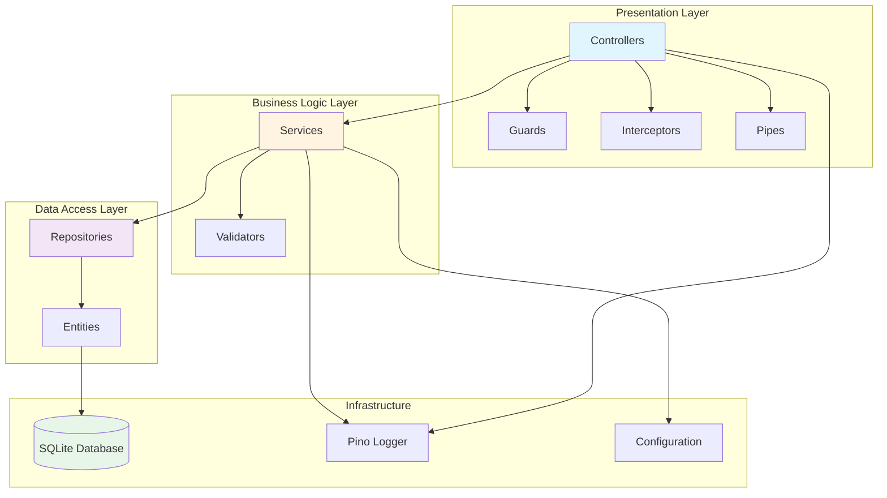
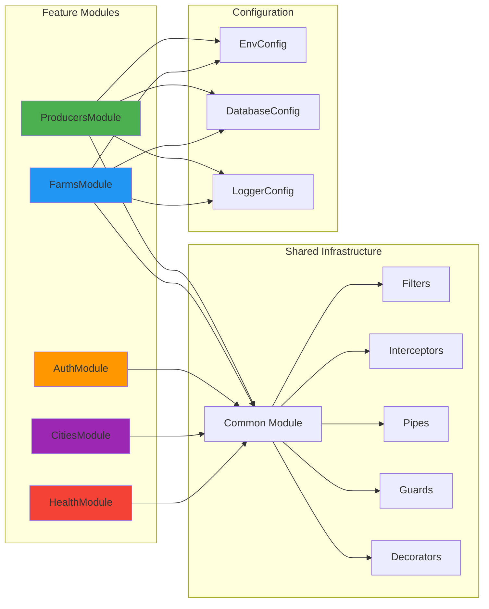
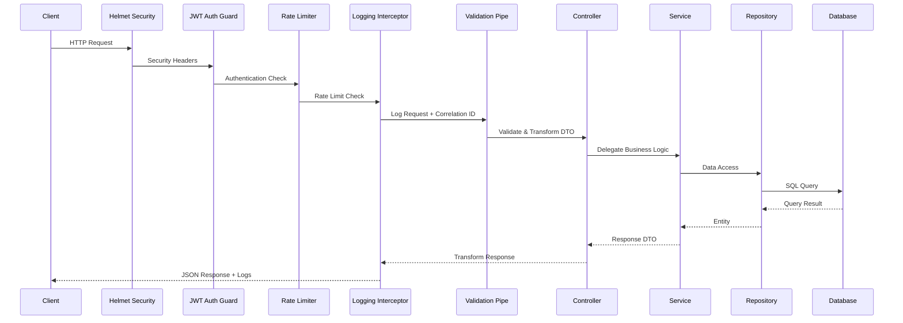
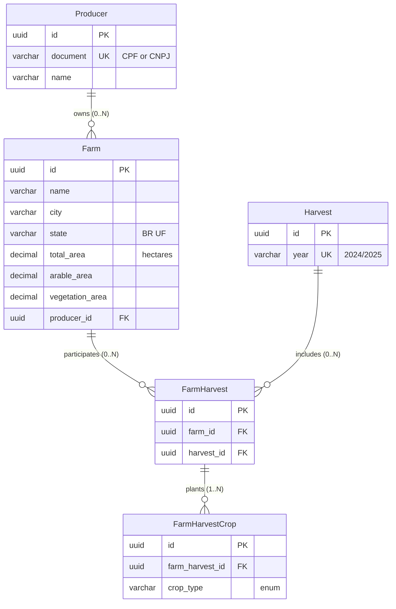
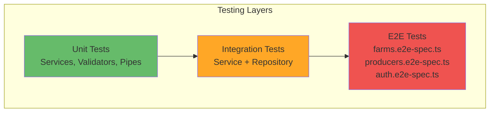

# Brain Agriculture - Backend API

> **Rural producer and farm management REST API**  
> Built with NestJS, TypeORM, and Bun runtime

Production-ready backend service providing CRUD operations, business logic validation, and analytics for agricultural operations management.

## Table of Contents

- [Architecture Overview](#architecture-overview)
- [API Structure](#api-structure)
- [Running the Application](#running-the-application)
- [Database Management](#database-management)
- [Testing Strategy](#testing-strategy)
- [Logging Configuration](#logging-configuration)
- [API Documentation](#api-documentation)
- [Environment Variables](#environment-variables)

## Architecture Overview

### Layered Architecture

The API follows a strict layered architecture pattern with clear separation of concerns:



### Module Organization

Feature modules encapsulate domain-specific logic with clear boundaries:



### Request Processing Flow



## API Structure

### Module Breakdown

```
apps/api/src/
├── main.ts                          # Application bootstrap & configuration
├── app.module.ts                    # Root module with global providers
├── app.controller.ts                # Root endpoint (health check)
│
├── config/                          # Centralized configuration
│   ├── database.config.ts           # TypeORM DataSource configuration
│   ├── env.config.ts                # Environment variable validation (Zod)
│   └── logger.config.ts             # Pino logger configuration
│
├── common/                          # Shared cross-cutting concerns
│   ├── decorators/                  # Custom decorators
│   │   ├── city-in-state.decorator.ts
│   │   └── public.decorator.ts
│   ├── enums/                       # Shared enumerations
│   │   └── enums.ts                 # BrazilianState, CropType
│   ├── filters/                     # Exception filters
│   │   └── http-exception.filter.ts
│   ├── guards/                      # Route guards
│   │   └── jwt-auth.guard.ts
│   ├── interceptors/                # Request/response interceptors
│   │   ├── correlation-id.interceptor.ts
│   │   ├── logging.interceptor.ts
│   │   └── transform.interceptor.ts
│   └── pipes/                       # Custom validation pipes
│       └── parse-uuid.pipe.ts
│
├── database/                        # Database infrastructure
│   ├── migrations/                  # TypeORM migrations
│   │   ├── 1732406400000-InitialSchema.ts
│   │   ├── 1732406500000-SeedCities.ts
│   │   └── 1732500000000-AddPerformanceIndexes.ts
│   └── seeds/                       # Database seed scripts
│       └── index.ts                 # Realistic Brazilian farm data
│
└── modules/                         # Feature modules
    ├── producers/                   # Producer domain
    │   ├── entities/
    │   │   └── producer.entity.ts
    │   ├── dto/
    │   │   ├── create-producer.dto.ts
    │   │   ├── update-producer.dto.ts
    │   │   └── producer-response.dto.ts
    │   ├── producers.module.ts
    │   ├── producers.controller.ts
    │   ├── producers.service.ts
    │   ├── producers.service.spec.ts
    │   └── producers.e2e-spec.ts
    │
    ├── farms/                       # Farm domain
    │   ├── entities/
    │   │   ├── farm.entity.ts
    │   │   ├── farm-harvest.entity.ts
    │   │   ├── farm-harvest-crop.entity.ts
    │   │   └── harvest.entity.ts
    │   ├── dto/
    │   │   ├── create-farm.dto.ts
    │   │   ├── update-farm.dto.ts
    │   │   ├── farm-response.dto.ts
    │   │   └── farm-stats-response.dto.ts
    │   ├── farms.module.ts
    │   ├── farms.controller.ts
    │   ├── farms.service.ts
    │   ├── farms.service.spec.ts
    │   └── farms.e2e-spec.ts
    │
    ├── cities/                      # City lookup service
    │   ├── entities/
    │   │   └── city.entity.ts
    │   ├── cities.module.ts
    │   └── cities.service.ts
    │
    ├── auth/                        # Authentication (JWT)
    │   ├── auth.module.ts
    │   ├── auth.controller.ts
    │   ├── auth.service.ts
    │   ├── auth.e2e-spec.ts
    │   ├── dto/
    │   ├── interfaces/
    │   └── strategies/
    │
    └── health/                      # Health check endpoints
        ├── health.module.ts
        └── health.controller.ts
```

### Design Patterns

| Pattern                  | Implementation                      | Purpose                                  |
| ------------------------ | ----------------------------------- | ---------------------------------------- |
| **Data Mapper**          | TypeORM Entities                    | Separate domain objects from database    |
| **Repository**           | `@InjectRepository()`               | Abstract data access layer               |
| **DTO Pattern**          | class-validator + class-transformer | Input/output validation & transformation |
| **Dependency Injection** | NestJS `@Injectable()`              | Loose coupling, testability              |
| **Strategy**             | CPF/CNPJ validators                 | Pluggable validation logic               |
| **Observer**             | Pino logger with context            | Event tracking across layers             |
| **Factory**              | Test fixtures & scenarios           | Test data generation                     |

## Running the Application

### Development Mode

```bash
# Install dependencies (from project root)
bun install

# Run with hot reload
bun run dev

# Run from API directory
cd apps/api
bun run dev
```

The API will start at `http://localhost:3000/api` (configurable via `API__PORT`).

### Production Build

```bash
# Build for production
bun run build

# Run production build
bun run start

# Or with environment
NODE_ENV=production bun dist/main.js
```

### Docker

```bash
# Build and run with Docker Compose (from project root)
docker-compose up api

# Build only
docker build -t brain-ag-api -f apps/api/Dockerfile .

# Run container
docker run -p 3000:3000 \
  -e API__DATABASE_PATH=/data/agro.db \
  -v $(pwd)/data:/data \
  brain-ag-api
```

### Available Scripts

| Script               | Command                                            | Description                      |
| -------------------- | -------------------------------------------------- | -------------------------------- |
| `dev`                | `bun --watch src/main.ts`                          | Development with hot reload      |
| `build`              | `bun build src/main.ts --outdir=dist --target=bun` | Production build                 |
| `start`              | `NODE_ENV=production bun dist/main.js`             | Run production build             |
| `type-check`         | `tsc --build`                                      | TypeScript type checking         |
| `test`               | `bun test`                                         | Run all tests                    |
| `test:watch`         | `bun test --watch`                                 | Run tests in watch mode          |
| `test:cov`           | `bun test --coverage`                              | Run tests with coverage          |
| `test:e2e`           | `bun test --coverage e2e`                          | Run E2E tests                    |
| `migration:generate` | `bun run typeorm migration:generate`               | Generate migration from entities |
| `migration:run`      | `bun run typeorm migration:run`                    | Apply pending migrations         |
| `migration:revert`   | `bun run typeorm migration:revert`                 | Revert last migration            |
| `db:seed`            | `bun run src/database/seeds/index.ts`              | Populate database with mock data |

## Database Management

### TypeORM Configuration

The API uses **TypeORM with Data Mapper pattern** and **better-sqlite3** driver for Bun compatibility.

**Configuration**: `src/config/database.config.ts`

```typescript
// Configured for production with migrations
{
  type: 'better-sqlite3',
  database: env.API__DATABASE_PATH,
  entities: ['src/modules/**/entities/*.entity.ts'],
  migrations: ['src/database/migrations/*.ts'],
  synchronize: false,  // NEVER true in production
  logging: env.API__DATABASE_LOGGING,
  migrationsRun: true  // Auto-run on startup
}
```

### Running Migrations

```bash
# Generate migration from entity changes
bun run migration:generate -- -n DescriptiveName

# Review generated migration in src/database/migrations/
# Then run migration
bun run migration:run

# Revert last migration if needed
bun run migration:revert
```

### Seeding Database

```bash
# Populate with 15 producers, 40 farms, multiple harvests
bun run db:seed
```

**Seed data includes**:

- Mix of CPF (individuals) and CNPJ (legal entities)
- Farms across Brazilian states with realistic distribution
- Multiple harvests per farm
- Diverse crop types (Soja, Milho, Algodão, Café, Cana de Açúcar)

**Location**: `src/database/seeds/index.ts`

### Entity Relationship Diagram

See [DATABASE_SCHEMA.md](../../docs/DATABASE_SCHEMA.md) for detailed schema documentation.



### Business Rules

- **CPF/CNPJ Validation**: Brazilian document format with digit verification
- **Farm Area Constraint**: `arable_area + vegetation_area ≤ total_area`
- **Document Uniqueness**: One document per producer
- **City Validation**: City must exist in state (custom decorator)

## Testing Strategy

### Test Pyramid



### Running Tests

```bash
# All tests
bun test

# Watch mode
bun test --watch

# Coverage report
bun test --coverage

# E2E tests only
bun test --coverage e2e
```

### Unit Tests

**Location**: `src/modules/**/*.spec.ts`

Test business logic in isolation with mocked dependencies:

```typescript
// Example: producers.service.spec.ts
const mockRepository = {
	findOne: jest.fn(),
	save: jest.fn(),
} as unknown as Repository<Producer>;

const module = await Test.createTestingModule({
	providers: [
		ProducersService,
		{ provide: getRepositoryToken(Producer), useValue: mockRepository },
	],
}).compile();
```

### E2E Tests

**Location**: `src/modules/**/*.e2e-spec.ts`

Test full request/response cycle with Supertest:

```typescript
// Example: Create producer
const response = await request(app.getHttpServer())
	.post("/api/producers")
	.send(createProducerDto)
	.expect(HttpStatus.CREATED);
```

### Test Fixtures

**Location**: `test/fixtures/`

Reusable test data generators:

- `producer.fixtures.ts` - Producer test data
- `farm.fixtures.ts` - Farm test data
- `constants.ts` - Test constants

### Test Scenarios

**Location**: `test/scenarios/`

Complex multi-entity test scenarios:

- `producers.scenario.ts` - Producer CRUD scenarios
- `farms.scenario.ts` - Farm management scenarios
- `scenarios.factory.ts` - Scenario composition

## Logging Configuration

### Structured Logging with Pino

The API uses **nestjs-pino** for structured JSON logging with correlation ID tracking.

```typescript
// Automatic request/response logging
{
  "level": "info",
  "time": 1732406400000,
  "correlationId": "550e8400-e29b-41d4-a716-446655440000",
  "method": "POST",
  "url": "/api/producers",
  "statusCode": 201,
  "responseTime": 45,
  "msg": "Request completed"
}
```

### Correlation IDs

Every request gets a unique correlation ID for distributed tracing:

```typescript
// Custom interceptor with AsyncLocalStorage
@Injectable()
export class CorrelationIdInterceptor implements NestInterceptor {
	intercept(context: ExecutionContext, next: CallHandler) {
		const correlationId = uuidv4();
		const request = context.switchToHttp().getRequest();
		request.correlationId = correlationId;
		// ... track across async operations
	}
}
```

### Log Levels

Configured via `API__LOG_LEVEL` environment variable:

- `fatal`: Critical errors requiring immediate attention
- `error`: Application errors (exceptions, failed operations)
- `warn`: Warning conditions (deprecated features, slow queries)
- `info`: General informational messages (startup, requests)
- `debug`: Detailed debugging information
- `trace`: Very detailed trace information

### Log Destinations

- **Console**: Enabled via `API__LOG_TO_CONSOLE=true`
- **File**: Rotated logs in `apps/api/logs/` directory
- **Production**: JSON format for log aggregation (ELK, Grafana Loki)

## API Documentation

### OpenAPI Specification

Interactive API documentation is available via **Scalar API Reference**:

**URL**: `http://localhost:3000/api/docs`

### Swagger UI (Alternative)

Classic Swagger UI is also available at:

**URL**: `http://localhost:3000/api/swagger`

### Documentation Features

- **Request/Response Schemas**: Auto-generated from DTOs
- **Validation Rules**: Displayed with constraints
- **Authentication**: JWT bearer token support
- **Examples**: Sample requests and responses
- **Try It Out**: Interactive API testing

### Generating OpenAPI JSON

```bash
# OpenAPI spec exported on startup to:
# dist/openapi.json
```

### Endpoint Documentation

All endpoints are documented with:

```typescript
@ApiTags('producers')
@ApiOperation({ summary: 'Create a new producer' })
@ApiResponse({ status: 201, description: 'Producer created successfully' })
@ApiResponse({ status: 400, description: 'Invalid input data' })
@Post()
async create(@Body() dto: CreateProducerDto) { }
```

## Environment Variables

### Configuration Schema

Environment variables are [validated with **Zod**](./src/config/env.config.ts) on application startup.

### Required Variables

| Variable                | Type                                              | Default                 | Description               |
| ----------------------- | ------------------------------------------------- | ----------------------- | ------------------------- |
| `NODE_ENV`              | `development` \| `production` \| `test`           | `development`           | Runtime environment       |
| `API__PORT`             | `number`                                          | `3000`                  | HTTP server port          |
| `API__DATABASE_PATH`    | `string`                                          | `data/agro.db`          | SQLite database file path |
| `API__LOG_LEVEL`        | `fatal` \| `error` \| `warn` \| `info` \| `debug` | `info`                  | Logging level             |
| `API__LOG_TO_CONSOLE`   | `boolean`                                         | `true`                  | Enable console logging    |
| `API__CORS_ORIGIN`      | `string` \| `null`                                | `http://localhost:5173` | CORS allowed origin       |
| `API__THROTTLE_TTL_MS`  | `number`                                          | `60000`                 | Rate limit window (ms)    |
| `API__THROTTLE_LIMIT`   | `number`                                          | `10`                    | Max requests per window   |
| `API__DATABASE_LOGGING` | `boolean`                                         | `false`                 | Enable SQL query logging  |

### Example Configuration

```bash
# .env.example
NODE_ENV=development
API__PORT=3000
API__DATABASE_PATH=data/agro.db
API__LOG_LEVEL=info
API__LOG_TO_CONSOLE=true
API__CORS_ORIGIN=http://localhost:5173
API__THROTTLE_TTL_MS=60000
API__THROTTLE_LIMIT=10
API__DATABASE_LOGGING=false
```

See [ENVIRONMENT.md](../../docs/ENVIRONMENT.md) for complete environment documentation.

## Security

### Security Headers (Helmet)

Helmet middleware configures secure HTTP headers:

- Content Security Policy (CSP)
- X-Frame-Options
- X-Content-Type-Options
- Strict-Transport-Security

### Rate Limiting

Global rate limiting with `@nestjs/throttler`:

- **Default**: 10 requests per 60 seconds per IP
- **Configurable**: `API__THROTTLE_TTL_MS`, `API__THROTTLE_LIMIT`

### Input Validation

All inputs validated with class-validator:

```typescript
@IsString()
@IsNotEmpty()
@MinLength(3)
@MaxLength(255)
name: string;
```

### Authentication

JWT-based authentication with Passport:

- **Guard**: `@UseGuards(JwtAuthGuard)`
- **Public routes**: `@Public()` decorator

## Related Documentation

- [Architecture Overview](../../docs/ARCHITECTURE.md) - System design and component structure
- [Database Schema](../../docs/DATABASE_SCHEMA.md) - Entity relationships and business rules
- [Environment Configuration](../../docs/ENVIRONMENT.md) - Complete environment variable reference
- [Monorepo Structure](../../docs/MONOREPO.md) - Workspace organization and development workflow
