# Brain Agriculture - System Architecture

> **Version**: 0.0.1  
> **Last Updated**: November 24, 2025  
> **Stack**: Bun + NestJS + TypeORM + React + Redux Toolkit  
> **Pattern**: Monorepo with workspace separation  
> **Assessment**: Full-stack rural producer and farm management system

## Table of Contents

1. [System Overview](#system-overview)
2. [Architecture Patterns](#architecture-patterns)
3. [Component Structure](#component-structure)
4. [Data Flow](#data-flow)
5. [Module Organization](#module-organization)
6. [API Design](#api-design)
7. [Security Architecture](#security-architecture)
8. [Scalability Considerations](#scalability-considerations)

---

## System Overview

### High-Level Context Diagram (C4 Level 1)

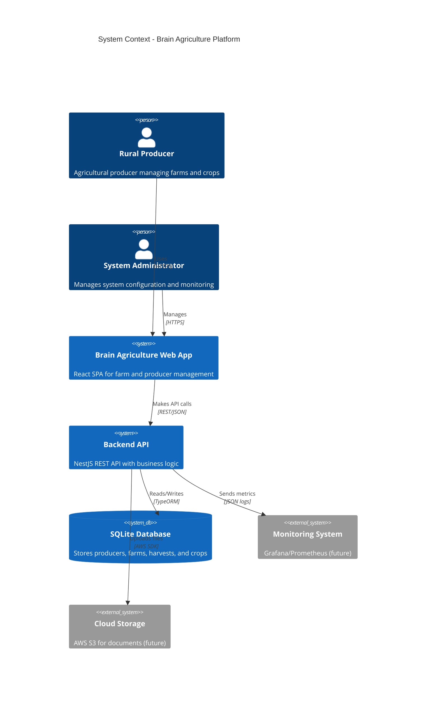

### Container Diagram (C4 Level 2)

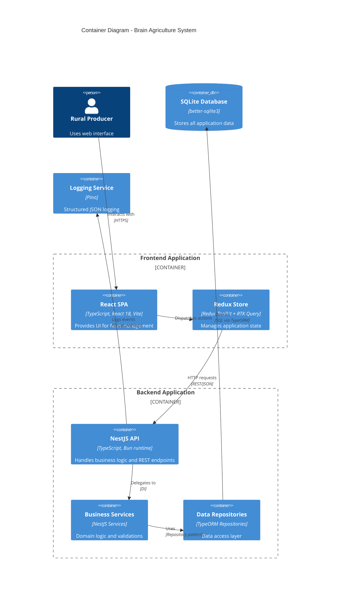

---

## Architecture Patterns

### Layered Architecture

The backend follows a **strict layered architecture** to ensure separation of concerns:

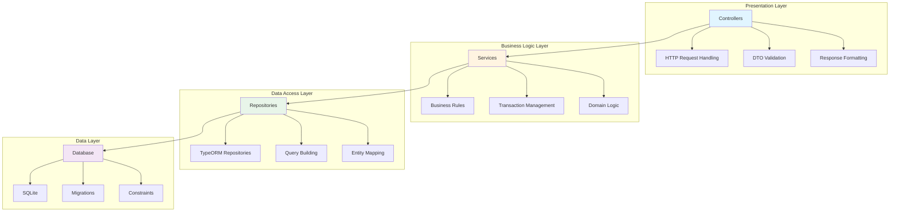

### Design Patterns in Use

| Pattern                  | Location          | Purpose                               | Example                                |
| ------------------------ | ----------------- | ------------------------------------- | -------------------------------------- |
| **Repository**           | Data Access Layer | Abstract database operations          | `ProducerRepository`, `FarmRepository` |
| **Data Mapper**          | TypeORM Entities  | Separate domain objects from database | All `*.entity.ts` files                |
| **Dependency Injection** | NestJS Modules    | Manage dependencies and lifecycle     | `@Injectable()`, `@Inject()`           |
| **DTO Pattern**          | Controllers       | Validate and transform input/output   | `CreateProducerDto`, `UpdateFarmDto`   |
| **Factory Pattern**      | Testing/Seeding   | Create test data                      | `ProducerFactory`, `FarmFactory`       |
| **Strategy Pattern**     | Validators        | Pluggable validation logic            | `validateCPF`, `validateCNPJ`          |
| **Observer Pattern**     | Logging           | Track events across layers            | Pino logger with context               |
| **Singleton**            | Configuration     | Single config instance                | `ConfigService`                        |

---

## Component Structure

### Backend Component Diagram (C4 Level 3)

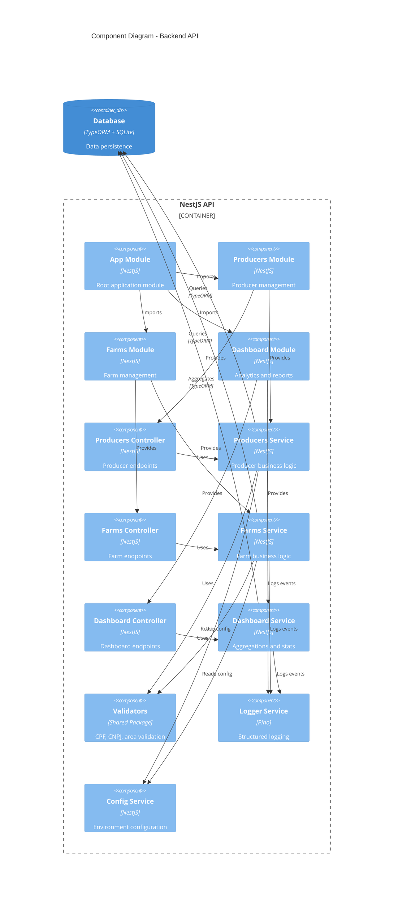

### Project Structure

```
brain-ag/
├── apps/
│   ├── api/                          # Backend NestJS application
│   │   ├── src/
│   │   │   ├── main.ts               # Application entry point
│   │   │   ├── app.module.ts         # Root module with imports
│   │   │   │
│   │   │   ├── common/               # Shared infrastructure
│   │   │   │   ├── filters/          # Exception filters
│   │   │   │   │   └── http-exception.filter.ts
│   │   │   │   ├── interceptors/     # Request/response interceptors
│   │   │   │   │   ├── logging.interceptor.ts
│   │   │   │   │   └── correlation-id.interceptor.ts
│   │   │   │   ├── guards/           # Route guards (auth, roles)
│   │   │   │   ├── decorators/       # Custom decorators
│   │   │   │   └── pipes/            # Validation pipes
│   │   │   │
│   │   │   ├── config/               # Configuration modules
│   │   │   │   ├── database.config.ts
│   │   │   │   ├── logger.config.ts
│   │   │   │   └── swagger.config.ts
│   │   │   │
│   │   │   ├── database/             # Database-related files
│   │   │   │   ├── data-source.ts    # TypeORM DataSource
│   │   │   │   ├── entities/         # TypeORM entities
│   │   │   │   │   ├── producer.entity.ts
│   │   │   │   │   ├── farm.entity.ts
│   │   │   │   │   ├── harvest.entity.ts
│   │   │   │   │   ├── farm-harvest.entity.ts
│   │   │   │   │   ├── farm-harvest-crop.entity.ts
│   │   │   │   │   ├── enums.ts
│   │   │   │   │   └── index.ts
│   │   │   │   ├── migrations/       # TypeORM migrations
│   │   │   │   │   └── 1732406400000-InitialSchema.ts
│   │   │   │   └── seeds/            # Database seed scripts
│   │   │   │       └── index.ts
│   │   │   │
│   │   │   ├── producers/            # Producer feature module
│   │   │   │   ├── producers.module.ts
│   │   │   │   ├── producers.controller.ts
│   │   │   │   ├── producers.service.ts
│   │   │   │   ├── producers.service.spec.ts
│   │   │   │   └── dto/
│   │   │   │       ├── create-producer.dto.ts
│   │   │   │       ├── update-producer.dto.ts
│   │   │   │       └── producer-response.dto.ts
│   │   │   │
│   │   │   ├── farms/                # Farm feature module
│   │   │   │   ├── farms.module.ts
│   │   │   │   ├── farms.controller.ts
│   │   │   │   ├── farms.service.ts
│   │   │   │   ├── farms.service.spec.ts
│   │   │   │   └── dto/
│   │   │   │       ├── create-farm.dto.ts
│   │   │   │       ├── update-farm.dto.ts
│   │   │   │       └── farm-response.dto.ts
│   │   │   │
│   │   │   ├── dashboard/            # Dashboard analytics module
│   │   │   │   ├── dashboard.module.ts
│   │   │   │   ├── dashboard.controller.ts
│   │   │   │   ├── dashboard.service.ts
│   │   │   │   ├── dashboard.service.spec.ts
│   │   │   │   └── dto/
│   │   │   │       └── dashboard-stats.dto.ts
│   │   │   │
│   │   │   └── utils/                # Backend-specific utilities
│   │   │       ├── logger.util.ts
│   │   │       ├── env.util.ts
│   │   │       └── constants.util.ts
│   │   │
│   │   ├── test/                     # E2E tests
│   │   │   ├── app.e2e-spec.ts
│   │   │   ├── producers.e2e-spec.ts
│   │   │   └── farms.e2e-spec.ts
│   │   │
│   │   ├── package.json
│   │   ├── tsconfig.json
│   │   └── nest-cli.json
│   │
│   └── web/                          # Frontend React application
│       ├── src/
│       │   ├── main.tsx              # Application entry point
│       │   ├── App.tsx               # Root component
│       │   │
│       │   ├── config/               # Configuration
│       │   │   ├── env.ts
│       │   │   └── constants.ts
│       │   │
│       │   ├── store/                # Redux store
│       │   │   ├── index.ts          # Store configuration
│       │   │   ├── hooks.ts          # Typed hooks
│       │   │   └── api/              # RTK Query API slices
│       │   │       ├── producers.ts
│       │   │       ├── farms.ts
│       │   │       └── dashboard.ts
│       │   │
│       │   ├── components/           # Atomic Design components
│       │   │   ├── atoms/            # Basic building blocks
│       │   │   │   ├── Button/
│       │   │   │   ├── Input/
│       │   │   │   └── Label/
│       │   │   ├── molecules/        # Simple composites
│       │   │   │   ├── FormField/
│       │   │   │   ├── Card/
│       │   │   │   └── SearchBar/
│       │   │   ├── organisms/        # Complex components
│       │   │   │   ├── ProducerForm/
│       │   │   │   ├── ProducerList/
│       │   │   │   └── DashboardGrid/
│       │   │   └── templates/        # Page layouts
│       │   │       └── MainLayout/
│       │   │
│       │   ├── features/             # Feature-specific code
│       │   │   ├── producers/
│       │   │   │   ├── ProducersPage.tsx
│       │   │   │   ├── ProducerDetailPage.tsx
│       │   │   │   └── hooks/
│       │   │   ├── farms/
│       │   │   └── dashboard/
│       │   │
│       │   ├── hooks/                # Shared custom hooks
│       │   │   ├── useDebounce.ts
│       │   │   └── useLocalStorage.ts
│       │   │
│       │   ├── theme/                # Theme configuration
│       │   │   ├── theme.ts
│       │   │   └── GlobalStyles.ts
│       │   │
│       │   └── utils/                # Frontend utilities
│       │       └── formatters.ts
│       │
│       ├── package.json
│       └── tsconfig.json
│
├── packages/
│   └── shared/                       # Shared code between apps
│       ├── src/
│       │   ├── index.ts
│       │   ├── types/                # Shared TypeScript types
│       │   │   └── index.ts
│       │   ├── validators/           # Business validation logic
│       │   │   ├── cpf.validator.ts
│       │   │   ├── cnpj.validator.ts
│       │   │   ├── farm-area.validator.ts
│       │   │   └── index.ts
│       │   └── utils/                # Shared utilities
│       │       ├── logger.util.ts
│       │       ├── env.util.ts
│       │       └── constants.util.ts
│       │
│       ├── package.json
│       └── tsconfig.json
│
├── docs/                             # Documentation
│   ├── ARCHITECTURE.md               # This file
│   ├── DATABASE_SCHEMA.md            # Database design
│   ├── ENVIRONMENT.md                # Environment variables
│   └── MONOREPO.md                   # Monorepo setup guide
│
├── .github/
│   ├── instructions/                 # AI/LLM coding guidelines
│   │   ├── backend.instructions.md
│   │   ├── frontend.instructions.md
│   │   ├── typescript.instructions.md
│   │   ├── jsdocs.instructions.md
│   │   └── testing.instructions.md
│   └── copilot-instructions.md       # Global Copilot settings
│
├── package.json                      # Root workspace config
├── tsconfig.json                     # Root TypeScript config
├── tsconfig.base.json                # Shared TypeScript config
├── .env                              # Environment variables (gitignored)
├── .env.example                      # Environment template
└── README.md                         # Project overview
```

---

## Data Flow

### Request/Response Flow

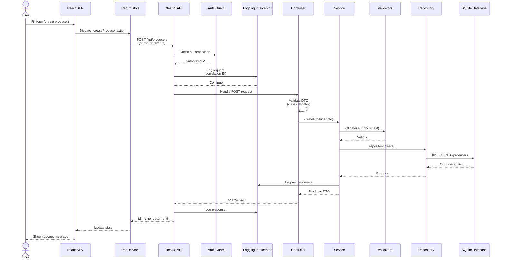

### State Management Flow (Frontend)

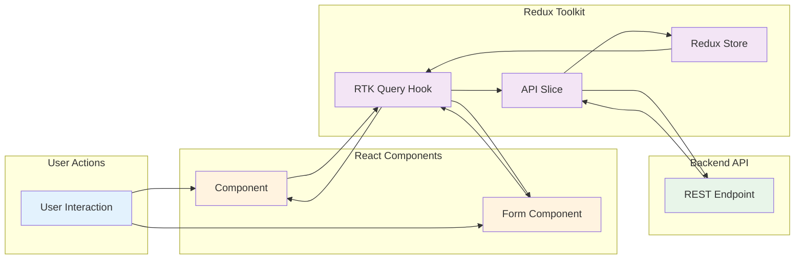

### Database Access Flow

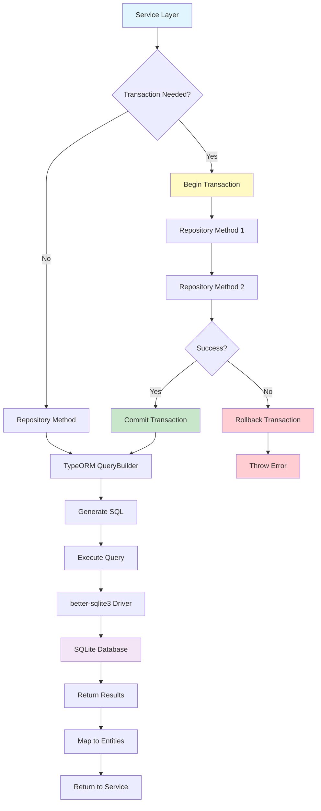

---

## Module Organization

### NestJS Module Dependency Graph

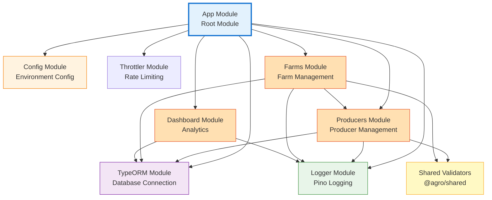

### Feature Module Structure Pattern

Each feature module follows this consistent structure:

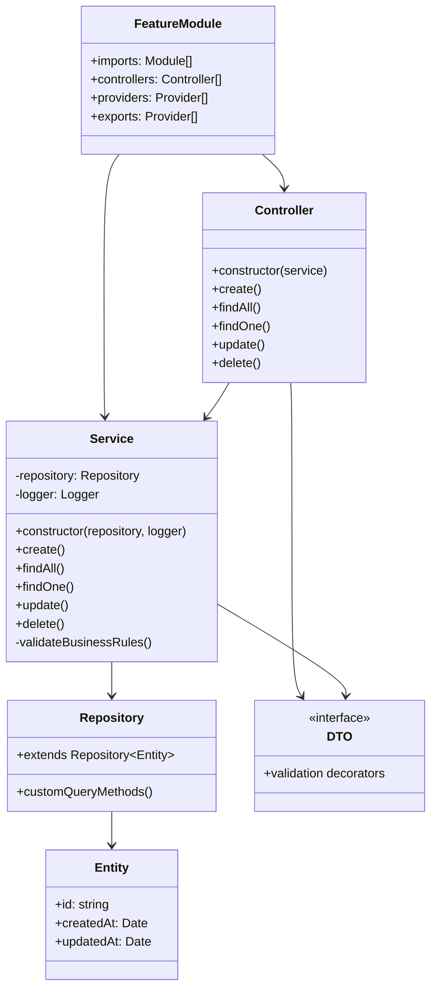

---

## API Design

### REST API Endpoints Structure

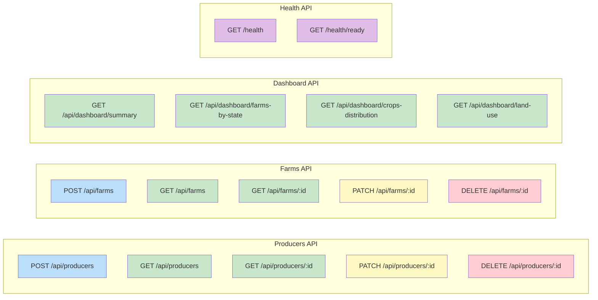

### API Contract Standards

| Aspect              | Standard              | Example                                                           |
| ------------------- | --------------------- | ----------------------------------------------------------------- |
| **Base Path**       | `/api` prefix         | `/api/producers`, `/api/farms`                                    |
| **Versioning**      | URL path (future)     | `/api/v1/producers`, `/api/v2/producers`                          |
| **Resource Naming** | Plural nouns          | `/producers`, `/farms` (not `/producer`)                          |
| **HTTP Methods**    | RESTful semantics     | POST=Create, GET=Read, PATCH=Update, DELETE=Remove                |
| **Status Codes**    | Standard HTTP         | 200 OK, 201 Created, 400 Bad Request, 404 Not Found               |
| **Request Body**    | JSON with DTOs        | `{ "name": "...", "document": "..." }`                            |
| **Response Body**   | JSON with DTOs        | `{ "id": "uuid", "name": "...", "createdAt": "..." }`             |
| **Error Format**    | NestJS standard       | `{ "statusCode": 400, "message": "...", "error": "Bad Request" }` |
| **Pagination**      | Query params          | `?page=1&limit=20`                                                |
| **Filtering**       | Query params          | `?state=SP&crop=Soja`                                             |
| **Sorting**         | Query params          | `?sort=name:asc,createdAt:desc`                                   |
| **Field Selection** | Query params (future) | `?fields=id,name,document`                                        |

### OpenAPI Documentation Structure

All endpoints are documented using `@nestjs/swagger` decorators:

```typescript
@Controller("producers")
@ApiTags("Producers")
export class ProducersController {
	@Post()
	@ApiOperation({ summary: "Create a new producer" })
	@ApiResponse({
		status: 201,
		description: "Producer created successfully",
		type: ProducerResponseDto,
	})
	@ApiResponse({
		status: 400,
		description: "Invalid input (CPF/CNPJ validation failed)",
	})
	async create(@Body() dto: CreateProducerDto): Promise<ProducerResponseDto> {
		// Implementation
	}
}
```

---

## Security Architecture

### Security Layers

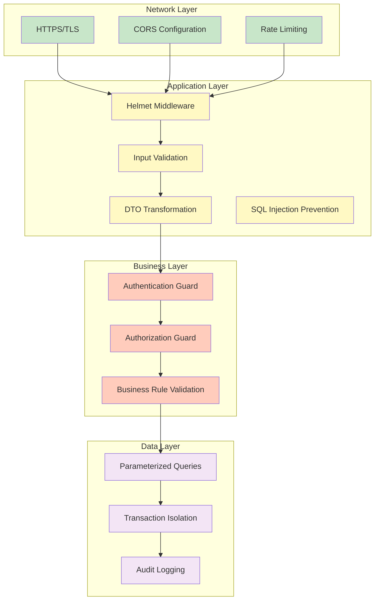

### Security Checklist

| Security Concern            | Mitigation                 | Implementation                             |
| --------------------------- | -------------------------- | ------------------------------------------ |
| **SQL Injection**           | Parameterized queries      | TypeORM QueryBuilder with parameters       |
| **XSS Attacks**             | Input sanitization         | class-validator + class-transformer        |
| **CSRF**                    | CORS configuration         | `@nestjs/common` CORS settings             |
| **DDoS**                    | Rate limiting              | `@nestjs/throttler` (100 req/min)          |
| **Sensitive Data Exposure** | DTO transformation         | `@Exclude()` decorator on sensitive fields |
| **Security Headers**        | Helmet middleware          | Content-Security-Policy, X-Frame-Options   |
| **Authentication**          | JWT tokens (future)        | `@nestjs/jwt` + `@nestjs/passport`         |
| **Authorization**           | Role-based access (future) | Custom guards with role decorators         |
| **Audit Trail**             | Structured logging         | Pino with correlation IDs                  |

---

## Scalability Considerations

### Microservices Migration Path

The current monolithic NestJS API is designed with **microservices readiness** in mind:

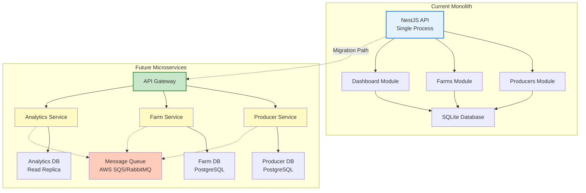

### Horizontal Scaling Strategy

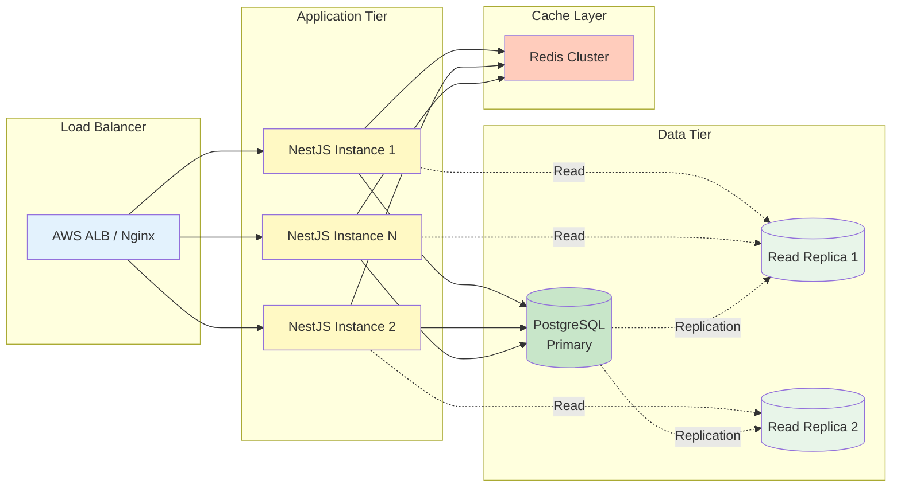

### Performance Optimization Points

| Bottleneck                 | Solution                  | Implementation Priority |
| -------------------------- | ------------------------- | ----------------------- |
| **Database Queries**       | Indexes on foreign keys   | ✅ Implemented          |
| **N+1 Queries**            | Query optimization, joins | 🔶 Phase 2              |
| **API Response Time**      | Redis caching             | 🔶 Phase 2              |
| **Dashboard Aggregations** | Materialized views        | 🔶 Phase 3              |
| **File Uploads**           | AWS S3 direct upload      | 🔶 Phase 3              |
| **Real-time Updates**      | WebSockets (Socket.io)    | 🔶 Phase 4              |
| **Search Performance**     | Elasticsearch             | 🔶 Phase 4              |
| **Background Jobs**        | Bull Queue + Redis        | 🔶 Phase 3              |

---

## Deployment Architecture

### AWS Infrastructure (Recommended for Production)

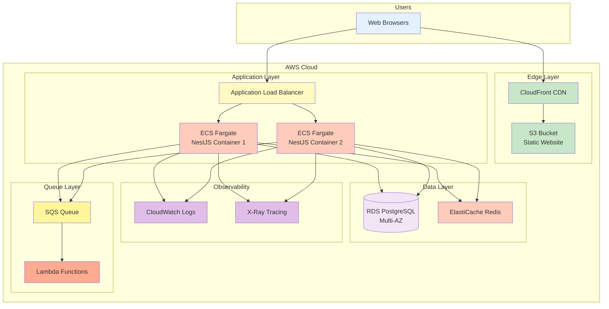

### Docker Containerization

Both frontend and backend are containerized with multi-stage builds:

**Backend Dockerfile Pattern:**

```dockerfile
# Stage 1: Build
FROM oven/bun:latest AS builder
WORKDIR /app
COPY package.json bun.lock ./
RUN bun install --frozen-lockfile
COPY . .
RUN bun run build

# Stage 2: Production
FROM oven/bun:alpine
WORKDIR /app
COPY --from=builder /app/dist ./dist
COPY --from=builder /app/node_modules ./node_modules
EXPOSE 3000
CMD ["bun", "run", "start:prod"]
```

**Frontend Dockerfile Pattern:**

```dockerfile
# Stage 1: Build
FROM node:20-alpine AS builder
WORKDIR /app
COPY package.json package-lock.json ./
RUN npm ci
COPY . .
RUN npm run build

# Stage 2: Nginx serve
FROM nginx:alpine
COPY --from=builder /app/dist /usr/share/nginx/html
COPY nginx.conf /etc/nginx/nginx.conf
EXPOSE 80
CMD ["nginx", "-g", "daemon off;"]
```

---

## Observability Strategy

### Logging Architecture

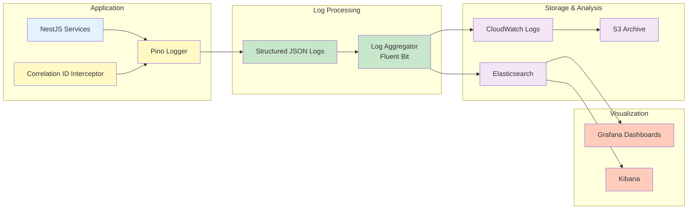

### Log Structure Standard

All logs follow a consistent JSON structure optimized for machine parsing:

```json
{
	"timestamp": "2025-11-24T12:00:00.000Z",
	"level": "info",
	"correlationId": "abc-123-def-456",
	"service": "producers-service",
	"method": "createProducer",
	"userId": "user-uuid",
	"message": "Producer created successfully",
	"context": {
		"producerId": "prod-uuid",
		"document": "111.444.777-35",
		"durationMs": 45
	}
}
```

### Metrics and Monitoring

| Metric Category            | Examples                            | Tool             |
| -------------------------- | ----------------------------------- | ---------------- |
| **Application Metrics**    | Request rate, error rate, latency   | Prometheus       |
| **Business Metrics**       | Producers created, farms registered | Custom logs      |
| **Infrastructure Metrics** | CPU, memory, disk usage             | CloudWatch       |
| **Database Metrics**       | Query performance, connection pool  | TypeORM logging  |
| **User Analytics**         | Page views, feature usage           | Google Analytics |

---

## Conclusion

This architecture provides a solid foundation for the Brain Agriculture platform with:

- ✅ **Separation of Concerns**: Clear layered architecture
- ✅ **Scalability**: Microservices-ready design
- ✅ **Maintainability**: Modular structure with consistent patterns
- ✅ **Testability**: Dependency injection and repository pattern
- ✅ **Observability**: Structured logging and monitoring readiness
- ✅ **Security**: Defense-in-depth approach
- ✅ **Performance**: Optimization points identified

**Next Steps**: Implement Service & Repository Layer with NestJS services and TypeORM repositories for the Producers and Farms domains.
